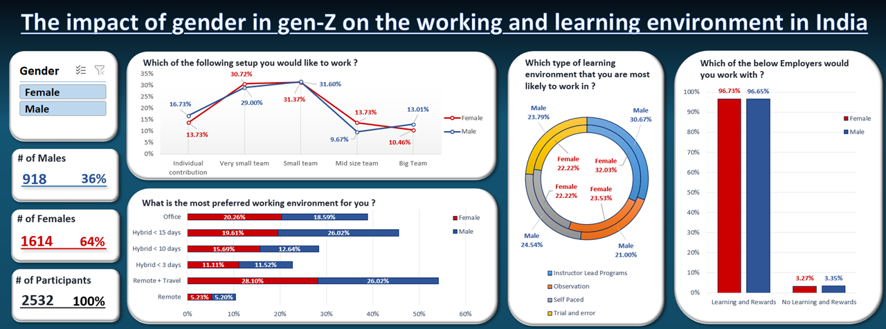
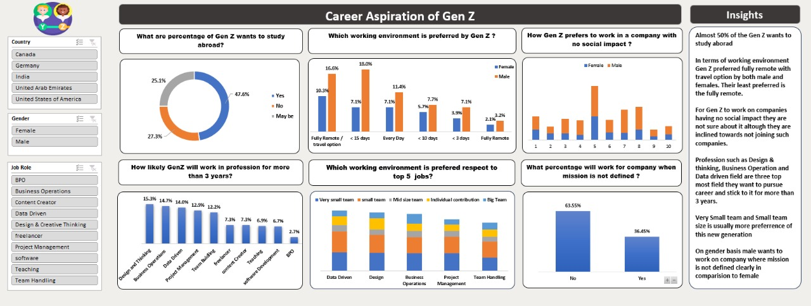

# Career Aspiration of Gen Z 
This is the repository to store all the necessary files that show the work was completed within our group CA1 for creating interactive dashboards in MS Excel.

**Author: Gleb Bikushev**

## Repository structure
- folder Gleb: to store Gleb's Excel file with dashboard and Diary
- folder Sunny: to store Sunny's Excel file with dashboard and Diary
- folder Emmanuel: to store Emmanuel's Excel file with dashboard and Diary
- Presentation
- Report

## Project Summary
Generation Z is set to surpass Millennials as the largest generation globally, impacting job roles, commercial consumption, science, technology, politics, and society. This generation has a different outlook on employment and achievement. The project aims to understand the challenges faced by this growing workforce, including the ethics of human-machine partnership, preparing for 50-60-year professions, and leveraging diverse talent sources.

## Data Source
The dataset obtained from Kaggle which revolves around the career aspirations of Gen-Z and has about 2634 rows and 15 fields of information collected as a form of a Survey, primarily from India and few other countries as well.

https://www.kaggle.com/datasets/kulturehire/understanding-career-aspirations-of-genz

## Data Cleaning
All categorical features are in long format therefore by using power query editor in Microsoft Excel, we have made it short without changing its meaning for better visualization and data labelling.

## Data visualization techniques
After data cleaning, a set of research questions were formed to obtain the insights from the data considering the aim of the project.  

We worked on this data using Microsoft Excel out of the provided data visualization tools. For analyzing the data Pivot Tables were utilized extensively and graph were used from Pivot chart.

## Findings  
### Findings from Sunny work
1) Almost 50% of the Gen Z wants to study aboard 

2) In terms of working environment Gen Z preferred fully remote with travel option by both male and females. Their least preferred is the fully remote.  

3) For Gen Z to work on companies having no social impact they are not sure about it although they are inclined towards not joining such companies. 

4) Profession such as Design & thinking, Business Operation and Data driven field are three topmost field they want to pursue career and stick to it for more than 3 years. 

### Findings from Gleb work
1) Both males and females of Generation-Z in India prefers to work in small teams with 5-6 people, while the least preferred option for males is "7 to 10 people" for and "More than 10 people" for females.

2) Generation-Z in India mainly prefers the working environment "Fully Remote with Options to travel as and when needed". 

3) As for learning environment, Generation-Z in India prefers "Instructor or Expert Learning Programs".

4) Both males and females of Generation-Z in India prefer to work with employer who enables a learning environment and rewards you at the end. 

### Findings from Emmanuel work
1) Parents are the most influential factor for both the genders for deciding their career. In terms of least for the gender it is social media. 

2) If right company is available then both male and female would like to work on company for more than 3 years. 

## Screenshots of the Excel Dashboards:
### Gleb's dashboard (mine):
**RQ: how does gender affect the working and learning environments of people of generation Z in India?**

### Sunny's dashboard:

## Future work
1) As we learn about the career aspirations and preferences of generation Z, we also must consider how companies are altering and transforming to meet these wishes of young employees. That is why, future work might include the analysis of dataset that covers this companies' transformation.​

2) Current dataset mainly consists the answers of participants of the survey from India. Future work might be supposed to include more participants from different countries to make comprehensive and multi-cultural analysis.